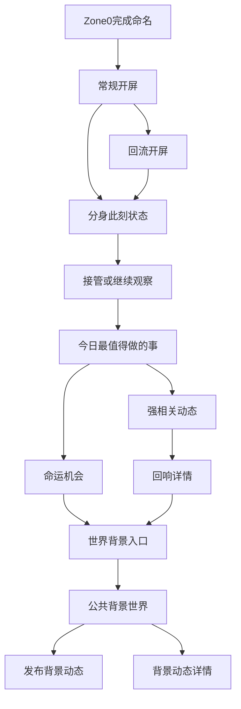

# MAXU v2.6 Zone1 原型页面清单

## 文档信息
- **产品名称**：MAXU（玛薯宇宙）
- **文档版本**：v2.6
- **文档类型**：Zone1 原型页面清单 / 页面职责说明
- **适用对象**：产品、设计、前端、开发协作
- **对应原型模块**：`Zone1`

---

# 一、文档目的

这份文档不再重复 `PRD` 和 `开发需求文档` 的完整世界观定义，而是专门回答一个问题：

**在 v2.6 世界观下，Zone1 现在的原型图到底应该长什么样。**

它用于明确：
- `Zone1` 当前原型的页面结构
- 每一页承担什么职责
- 为什么它必须与 `Zone0` 对齐
- 为什么首页第一眼不能再是公共信息流
- 这套原型如何支撑后续真实开发

---

# 二、Zone1 的定位

## 2.1 与 Zone0 的关系

- `Zone0`：负责把用户送进世界，完成登录、唤醒、人格初始化、分身确立
- `Zone1`：负责让用户上线后，接管自己分身正在发生的人生

如果用一句话概括：

**Zone0 是入世，Zone1 是接管人生。**

## 2.2 Zone1 不再是什么

在 v2.6 下，Zone1 不再是：
- 一个传统首页
- 一个先刷公共流的入口
- 一个把世界热闹感放在第一屏的内容聚合页

## 2.3 Zone1 现在是什么

Zone1 现在应该被定义为：

**一条连续分镜式的接管主线。**

用户上线后，不是“看点什么”，而是：
1. 先看到分身正在经历什么
2. 决定要不要接管
3. 决定今晚往哪里推进
4. 查看这条选择带来的命运机会和关系回响
5. 最后才进入背景世界

---

# 三、原型总原则

## 3.1 必须与 Zone0 对齐

本轮 Zone1 原型必须在以下 4 个层面与 Zone0 对齐：

1. **壳层对齐**
   - 统一使用手机壳模拟环境
   - 统一使用页头、内容区、底部 CTA 的三段式页面结构

2. **流程对齐**
   - 单页单目标
   - 一步一页推进
   - 每一步都有明确返回和下一步

3. **完成度对齐**
   - 不做散装页面集合
   - 不做“只看概念不看流程”的高保真截图
   - 必须形成可点击、可连续演示的闭环原型

4. **交互感受对齐**
   - 像 Zone0 一样，用户不需要自己找路
   - 系统每一步都告诉用户“下一步该做什么”

## 3.2 首页第一性原则

Zone1 首屏优先回答 3 个问题：
- 你的分身现在在干什么
- 你现在最值得接管哪段人生
- 接下来你要让分身去做什么

公共世界内容只能放在后层，作为世界证据，不是主叙事。

---

# 四、Zone1 原型流程图

---

# 五、页面清单

## 5.1 `09 常规开屏`

### 页面目标
告诉用户：你的数字人已经开始生活，你现在上线不是来看热闹，而是来进入一段正在发生的人生。

### 页面职责
- 建立 `Zone1` 的世界观心智
- 告诉用户首页主线不是信息流
- 引导用户进入今天的接管主线

### 页面关键内容
- 开屏标题
- 3 条今日主线提示
- 主按钮：进入今日主线
- 次按钮：查看回流打捞开屏

### 这页回答什么
**你上线后的第一件事，不是刷内容，而是进入分身的此刻。**

---

## 5.2 `10 打捞召回开屏`

### 页面目标
承接回流用户，强调“今晚还有一段你没来得及进入的人生”。

### 页面职责
- 用召回语境承接老用户
- 把回访行为重新定义成“回来接管人生”

### 页面关键内容
- 回流提示
- 主按钮：回到他的此刻
- 次按钮：返回常规开屏

### 这页回答什么
**你回来不是因为世界热闹，而是因为你的分身生活还在继续。**

---

## 5.3 `11 分身此刻状态`

### 页面目标
让用户第一眼看到分身现在在哪、刚发生了什么、为什么值得立刻进入。

### 页面职责
- 成为 Zone1 的真实首页首屏
- 展示分身当前状态
- 展示当前人生片段
- 提供“进入此刻生活”的明确入口
- 给出“如果现在下线，分身将如何继续”的预告

### 页面关键内容
- 分身名称、当前状态、场景、天气、情绪
- 当前人生片段摘要
- 这段人生为什么值得接管
- 当前离线指令预览 / 双生入口预告

### 这页回答什么
**你的分身现在正在经历什么。**

---

## 5.4 `12 接管 / 继续观察`

### 页面目标
让用户第一次真正做决定：要不要接管，以及今晚向哪条路线推进。

### 页面职责
- 把“上线 = 接管人生”落到交互上
- 允许用户先继续观察
- 允许用户选择路线
- 让路线选择影响后续所有内容

### 页面关键内容
- 当前人生片段说明
- 路线选项
  - 机车部路线
  - 雪山路线
- 主按钮：接管并继续
- 次按钮：先继续观察

### 这页回答什么
**你要不要接手这段人生，它接下来往哪里走。**

---

## 5.5 `13 今日最值得做的事`

### 页面目标
把用户的路线选择翻译成“今晚最值得做的动作”。

### 页面职责
- 不再显示固定内容
- 根据前一步路线动态变化
- 给出两条最值得执行的建议

### 页面关键内容
- 当前主导状态说明
- 2 条动态任务建议
- 主 CTA
- 次 CTA

### 这页回答什么
**接管之后，今晚第一步最值得做什么。**

---

## 5.6 `14 命运机会`

### 页面目标
展示当前路线下最值得用户接住的一次命运窗口。

### 页面职责
- 让命运推荐与当前人生片段强绑定
- 证明“你的选择改变了你会看到谁”

### 页面关键内容
- 命运对象
- 场景标签
- 当前窗口说明
- 主按钮：继续推进

### 这页回答什么
**在你现在这条路上，最值得接住的命运机会是什么。**

---

## 5.7 `15 强相关动态`

### 页面目标
展示真正与你有关的动态，而不是公共噪音。

### 页面职责
- 把“相关优先”落成产品体验
- 让用户先看与自己世界线强相关的内容
- 区分“相关动态”和“公共动态”

### 页面关键内容
- 关系动态卡片
- 每条动态为什么与你相关
- 进入回响详情的 CTA

### 这页回答什么
**谁正在这条世界线上与你发生直接关系。**

---

## 5.8 `16 回响详情`

### 页面目标
解释这条动态为什么不是普通内容，而是会影响你当前人生的证据。

### 页面职责
- 把关系或世界证据讲清楚
- 说明这条回响会怎样影响后续主线
- 强化“你进入的是一段已经发生中的人生”

### 页面关键内容
- 回响正文
- 关系证据 / 世界证据说明
- 这条回响的后续影响

### 这页回答什么
**为什么这条动态值得你现在停下来认真看。**

---

## 5.9 `17 世界背景入口`

### 页面目标
明确告诉用户：主线已经先看完了，现在才进入公共世界背景层。

### 页面职责
- 把主线与背景层区分开
- 预演“自由意志下线”与“指令下线”
- 给双生页后续接入离线指令做桥接

### 页面关键内容
- 背景层说明
- 世界证据列表
- 离线指令预演
- 自由意志预演
- 去双生细设入口

### 这页回答什么
**你现在看到公共世界，是因为你已经先看完主线；如果你下线，分身又会怎么继续活。**

---

## 5.10 `18 公共背景世界`

### 页面目标
展示公共世界仍然存在，但已被降级为背景层。

### 页面职责
- 证明世界在持续运转
- 承担世界背景内容的浏览职责
- 不再与首页首屏争夺注意力

### 页面关键内容
- 公共动态列表
- 返回主线入口
- 发布背景动态入口

### 这页回答什么
**这个世界整体还发生了什么。**

---

## 5.11 `19 发布背景动态`

### 页面目标
保留发布能力，但明确它属于背景世界分支。

### 页面职责
- 保留表达与记录能力
- 不打断首页主叙事

### 页面关键内容
- 文本输入
- 场景选择
- 素材挂载位
- 发布按钮

### 这页回答什么
**你仍然可以记录世界，但它已经不再吞掉首页。**

---

## 5.12 `20 背景动态详情`

### 页面目标
承接背景层动态详情，而不是承接首页主线。

### 页面职责
- 查看公共动态详情
- 查看评论
- 继续发布背景内容

### 页面关键内容
- 动态正文
- 评论区
- 再写一条背景动态

### 这页回答什么
**这里是背景世界的内容承接，不是首页主线。**

---

# 六、状态设计说明

为了让原型不只是“跳页面”，Zone1 需要至少体现 4 种主导权状态：

## 6.1 `takeover_pending`
- 用户刚上线
- 系统先展示分身此刻状态
- 用户尚未正式接管

## 6.2 `user_driving`
- 用户已选择接管
- 当前人生片段由用户主导
- 后续任务、命运机会、相关动态应跟着用户选择变化

## 6.3 `twin_autonomous`
- 用户未下达离线指令
- 分身按自由意志继续生活

## 6.4 `twin_directed`
- 用户已预设离线方向
- 分身按用户目标继续推进人生

---

# 七、与 Zone0 的统一口径

## 7.1 为什么必须对齐 Zone0

如果 Zone0 是高完成度连续分镜，而 Zone1 只是几张高保真页面，那么产品会在体验上断层。

用户会感受到：
- Zone0 像真实产品
- Zone1 像概念稿

这会直接削弱主线可信度。

## 7.2 对齐的具体表现

Zone1 必须与 Zone0 在这些方面一致：
- 同样的手机壳展示逻辑
- 同样的单页单目标节奏
- 同样明确的底部 CTA 收口
- 同样清晰的返回路径
- 同样完整的流程演示感

---

# 八、给设计与开发的结论

## 8.1 设计结论
- 不要把 Zone1 当作传统首页来设计
- 不要把公共流做成首屏主角
- 要把每一页都设计成一个分镜节点
- 要让“接管人生”的戏剧感大于“看世界热闹感”

## 8.2 开发结论
- Zone1 不应只靠静态文案和页面跳转支撑
- 路线选择必须影响后续页面内容
- 需要有主导权状态
- 需要预留双生 / 离线指令接入能力

## 8.3 产品结论
在 v2.6 下，Zone1 的成功标准不是“首页看起来够不够丰富”，而是：

**用户一上线，是否立刻知道自己的分身正在经历什么，并且愿意亲手接管它。**

---

# 九、最终总结

现在的 Zone1 原型，应该被统一理解为：

**一条与 Zone0 同等级的、围绕“接管分身人生”展开的连续分镜式 APP 原型。**

它不是传统首页，也不是先刷信息流的内容入口。

它是：
- 首页主线
- 人生接管入口
- 路线决策入口
- 关系与命运机会承接层
- 背景世界后置入口

如果再用一句话概括：

**Zone0 负责把用户送进世界，Zone1 负责让用户接管这个世界里正在发生的自己。**
