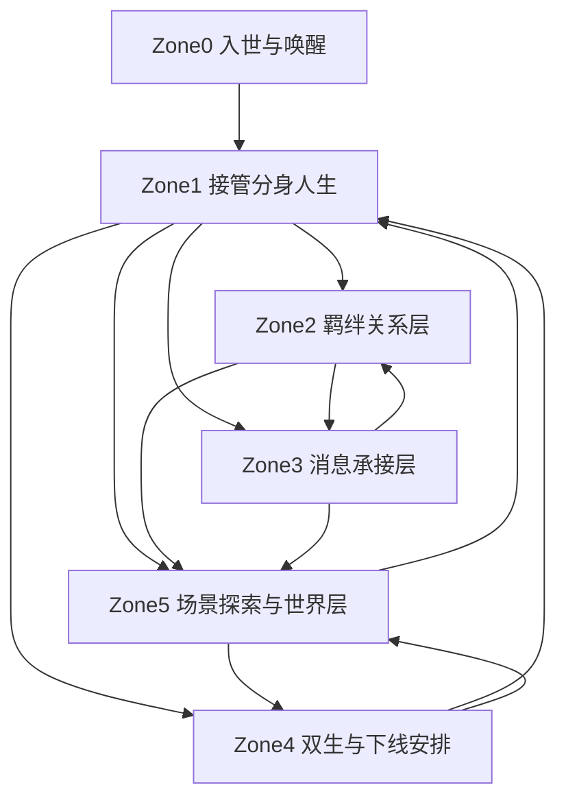

# MAXU v2.6 全链路原型总览

## 文档信息
- **产品名称**：MAXU（玛薯宇宙）
- **文档版本**：v2.6
- **文档类型**：全链路原型总览 / 跨 Zone 结构说明
- **适用对象**：产品、设计、前端、开发、协作评审

---

# 一、文档目的

这份文档用于把当前已经完成的 `Zone0` 到 `Zone5` 原型，统一整理成一张完整地图。

它回答 4 个问题：
- MAXU v2.6 的整条原型链路现在是什么
- 每个 `Zone` 各自承担什么职责
- 它们之间如何前后衔接
- 团队接下来应该如何使用这套原型推进设计和开发

---

# 二、v2.6 的总主线

在 v2.6 下，MAXU 的完整产品主线已经不是“用户打开 App 看首页”，而是：

1. 用户进入世界
2. 用户接管分身人生
3. 用户看到哪些关系正在影响自己
4. 用户通过消息承接沟通
5. 用户在下线前安排分身继续怎么活
6. 用户在世界中通过场景、同游、事件和信物继续推进这段人生

如果用一句话概括：

**MAXU v2.6 的原型主线，是“入世 -> 接管 -> 关系 -> 沟通 -> 交还 -> 世界继续运转”。**

---

# 三、全链路结构图

---

# 四、每个 Zone 的一句话定位

## Zone0
**把用户送进世界。**

负责：
- 登录 / 注册
- 偏好初始化
- 人格问答
- 分身唤醒
- 分身命名

结论：
`Zone0` 是整个世界观体验的入口，不只是注册流程。

## Zone1
**让用户上线后接管分身人生。**

负责：
- 展示分身此刻状态
- 决定是否接管
- 决定今晚往哪条路线推进
- 展示强相关动态与命运机会
- 最后才进入背景世界

结论：
`Zone1` 是首页主线，不是公共信息流入口。

## Zone2
**展示谁正在改变我的人生主线。**

负责：
- 羁绊列表
- 好友羁绊主页
- 创世记忆
- 共同经历时间线
- 同游发起
- 分身边界权限

结论：
`Zone2` 是关系存在感中心，不是通讯录替代。

## Zone3
**承接沟通，但不替代世界本体。**

负责：
- 混合消息列表
- 游离态盲盒聊天室
- 72 小时揭面中心
- 羁绊态正式聊天室
- 关系切换提示

结论：
`Zone3` 是沟通承接层，不是首页，也不是关系本身。

## Zone4
**让用户下线前安排分身接下来怎么活。**

负责：
- 双生首页
- 分身状态中心
- 离线指令配置
- 分身边界配置
- 资产沉淀
- 下线前确认

结论：
`Zone4` 是控制舱，但更重要的是它是“交还人生主导权”的地方。

## Zone5
**让世界真的发生。**

负责：
- 探险版图
- 场景详情
- 场景进入 / 排队
- 今晚去向设置
- 同游发起
- 场景事件
- 世界热点 / 运营事件
- 场域信物

结论：
`Zone5` 是世界主梁，不是背景壳。

---

# 五、链路拆解

## 5.1 第一段：入世

由 `Zone0` 完成。

用户完成的不是账户操作，而是：
- 进入世界
- 初始化自己的分身
- 让系统开始拥有一个会继续生活的“自己”

输出结果：
- 用户已经拥有一个可被接管的分身
- 用户具备进入 `Zone1` 的资格

## 5.2 第二段：接管

由 `Zone1` 完成。

用户完成的不是浏览首页，而是：
- 看到分身现在正在做什么
- 决定要不要接管
- 决定今晚往哪里走
- 接住命运机会和强相关动态

输出结果：
- 一条具体的人生片段被选中
- 用户知道接下来要继续推进哪条主线

## 5.3 第三段：关系沉淀

由 `Zone2` 完成。

用户完成的不是查看好友，而是：
- 理解一段关系为什么会优先影响主线
- 看到这段关系的创世起点和共同经历
- 决定是否进一步通过同游推进

输出结果：
- 关系被从“动态”升级为“可持续影响主线的羁绊”

## 5.4 第四段：沟通承接

由 `Zone3` 完成。

用户完成的不是机械聊天，而是：
- 在游离态中试探
- 在羁绊态中正式沟通
- 通过揭面或正式对话把关系推入下一阶段

输出结果：
- 消息把用户送回关系页或场景页，而不是自己成为终点

## 5.5 第五段：下线安排

由 `Zone4` 完成。

用户完成的不是看“我的资料”，而是：
- 决定下线后分身如何继续生活
- 决定是否给出离线指令
- 决定边界与主动范围
- 确认已有资产和世界痕迹

输出结果：
- 分身从“被接管”切换到“被交还”
- 后续生活方向清晰

## 5.6 第六段：世界继续运转

由 `Zone5` 完成。

用户看到的不是地图摆设，而是：
- 分身还能去哪里
- 哪些场景还在升温
- 哪些事件正在发生
- 同游如何落地
- 场域信物如何改变准入与价值

输出结果：
- 产品真正具备“世界在持续运转”的证据感

---

# 六、当前原型文档清单

目前已具备的 v2.6 文档包括：

- `MAXU_v2.6_PRD.md`
- `MAXU_v2.6_开发需求版.md`
- `MAXU_v2.6_Zone1原型页面清单.md`
- `MAXU_v2.6_Zone2原型页面清单.md`
- `MAXU_v2.6_Zone3原型页面清单.md`
- `MAXU_v2.6_Zone4原型页面清单.md`
- `MAXU_v2.6_Zone5原型页面清单.md`
- `MAXU_v2.6_全链路原型总览.md`

这意味着：
- 世界观主轴已经明确
- 开发结构口径已经明确
- 各 Zone 页面职责已经明确
- 全局链路关系也已经明确

---

# 七、团队协作使用方式

## 7.1 产品使用方式

产品侧可以用这套原型回答：
- v2.6 到底改了什么
- 为什么首页不再以公共流开场
- 为什么双生页职责被升级
- 为什么场景要被重新抬回主梁位置

## 7.2 设计使用方式

设计侧可以按这套结构继续深化：
- 每个 Zone 的视觉层次
- 页面与页面之间的过渡
- 深浅主题切换
- 关系、场景、控制舱的视觉差异化

## 7.3 开发使用方式

开发侧可以把这套原型当成：
- 路由结构草图
- 状态流转草图
- mock 数据结构草图
- 页面职责拆分草图

它还不是最终业务实现，但已经足够作为开发对齐底稿。

---

# 八、当前阶段结论

现在的 MAXU v2.6 原型，已经不再只是“Zone0 工程化 + Zone1 首页重做”。

它已经形成了一条完整的产品体验链：

- `Zone0`：把你送进世界
- `Zone1`：让你接管自己
- `Zone2`：让你看到谁正在影响你
- `Zone3`：让沟通继续推进关系
- `Zone4`：让你下线前安排未来
- `Zone5`：让世界继续运转

如果用一句话作为最终总结：

**MAXU v2.6 的整套原型，已经从“一个首页概念”升级为“一个用户与 AI 分身轮流接管同一段元宇宙人生”的完整体验骨架。**
